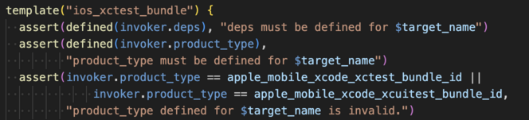
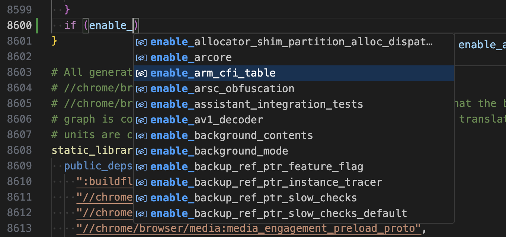
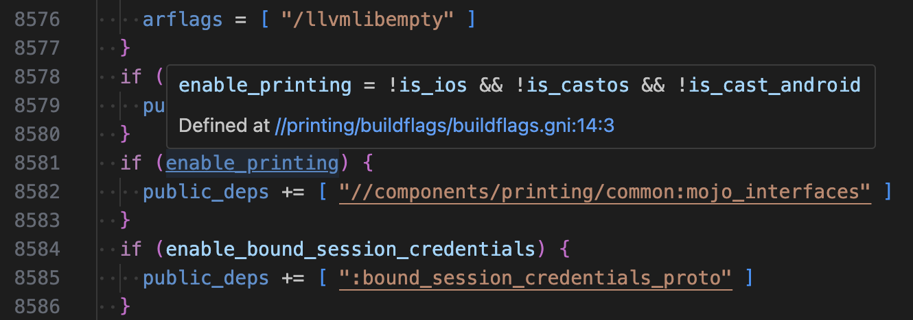
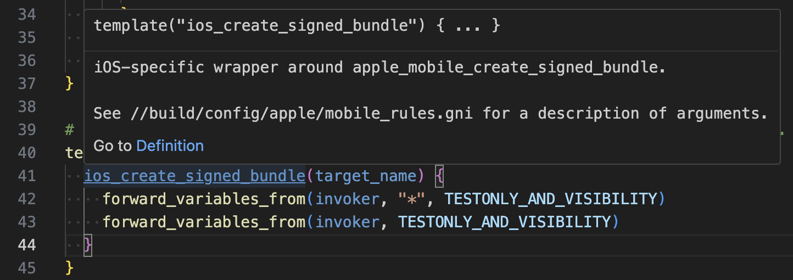
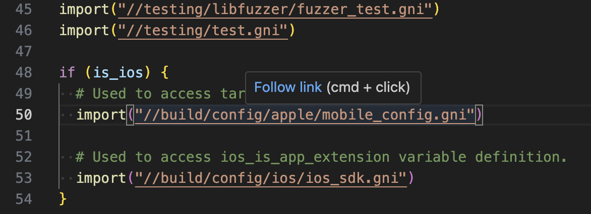
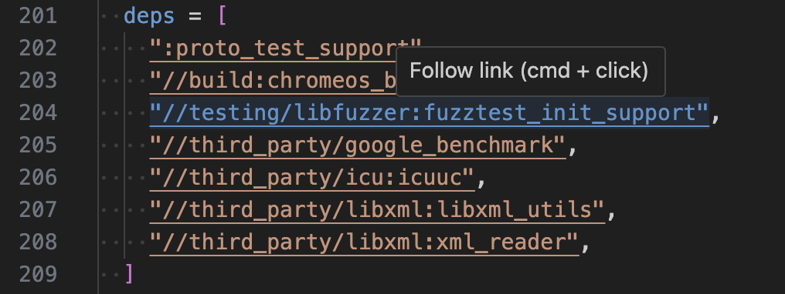
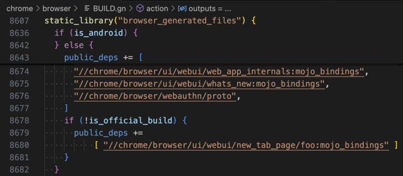
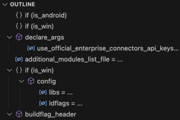
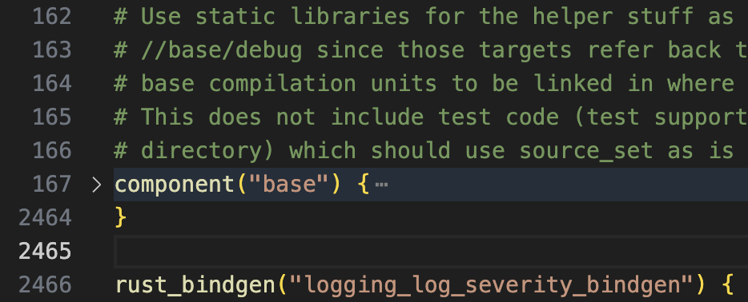

# GN Language Server

A [language server](https://microsoft.github.io/language-server-protocol/) for
[GN](https://gn.googlesource.com/gn/),
the build configuration language used for Chromium.

## Features

### Syntax highlighting

### Completion

### Hover documentation

### Go to definition

### Following imports

### Following dependencies

### Sticky scroll with useful lines

### Outline

### Code folding

## TODO

- Formatting

## Disclaimer

This is not an officially supported Google product. This project is not
eligible for the [Google Open Source Software Vulnerability Rewards
Program](https://bughunters.google.com/open-source-security).
